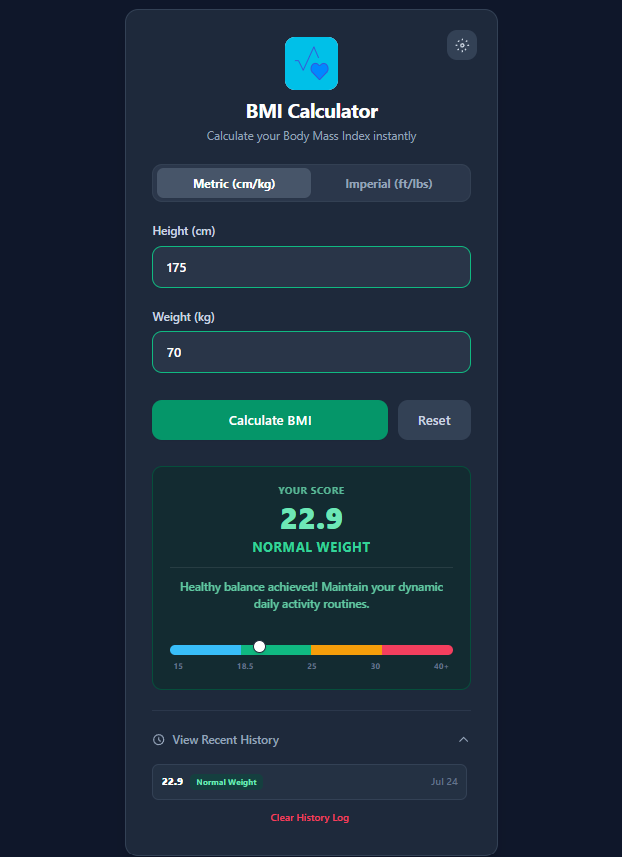

# 📊 BMI Calculator — Minimalist & Responsive Web Application

[](https://rahulxdev1201.github.io/bmi-calculator/)
[](https://rahulxdev1201.github.io/bmi-calculator/)
[](https://rahulxdev1201.github.io/bmi-calculator/)
[](https://rahulxdev1201.github.io/bmi-calculator/)
[](https://rahulxdev1201.github.io/bmi-calculator/)
[](LICENSE)

A lightweight, high-performance web application designed for accurate Body Mass Index (BMI) computation and immediate health risk classification. Built with a zero-dependency architecture, the application delivers real-time validation, adaptive color-coded health categorization, and dynamic micro-interactions.


---

## 📑 Table of Contents

- [Overview](#-overview)
- [Key Features & Engineering Highlights](#-key-features--engineering-highlights)
- [Lighthouse Audit Metrics](#-lighthouse-audit-metrics)
- [Calculation Methodology](#-calculation-methodology)
- [Technology Stack & Architecture](#-technology-stack--architecture)
- [Directory Structure](#-directory-structure)
- [Local Setup & Deployment](#-local-setup--deployment)
- [Contributing](#-contributing)
- [License](#-license)

---

## 📖 Overview

The **BMI Calculator** provides users with an instant assessment of their physical health categorization based on standardized metrics. Designed with simplicity, speed, and accessibility in mind, the application processes height and weight inputs locally without network overhead, presenting results alongside visual indicator states.

---

## ✨ Key Features & Engineering Highlights

* **🛡️ Client-Side Validation Engine:** Intercepts invalid inputs—including empty fields, non-numeric strings, and out-of-range physical values—providing clear UI micro-copy responses.
* **🎨 Dynamic Contextual Styling:** Dynamically updates UI color palettes and indicators depending on the calculated classification (Underweight, Normal Weight, Overweight, or Obese).
* **⚡ Zero-Shift Transitions:** Employs optimized CSS transforms (`cubic-bezier` easing) to render score transitions smoothly without triggering expensive layout reflows.
* **📱 Fully Responsive Design:** Utilizes a fluid grid layout optimized for mobile viewports, tablet form factors, and widescreen desktop monitors.
* **🚀 Zero Build Step Overhead:** Built natively without external bundlers or heavy node dependencies, guaranteeing minimal cold-start load time.

---

## ⚡ Lighthouse Audit Metrics

The application has been audited using Google Lighthouse to ensure high standards in performance, web accessibility, and code quality:

| Metric | Score | Rating | Optimization Focus |
| :--- | :---: | :---: | :--- |
| ⚡ **Performance** | **97 / 100** | 🟢 Excellent | Minimal DOM size, deferred script loading, fast execution. |
| ♿ **Accessibility** | **95 / 100** | 🟢 Excellent | High color contrast ratios, screen-reader friendly elements. |
| ✅ **Best Practices** | **100 / 100** | 🟢 Perfect | Modern HTML5 standards, zero console errors, clean execution. |
| 🔍 **SEO** | **91 / 100** | 🟢 Excellent | Optimized document metadata and structured headings. |

---

## 📐 Calculation Methodology

Body Mass Index (BMI) is calculated using standard World Health Organization (WHO) formulas:

$$BMI = \frac{\text{weight (kg)}}{\left(\text{height (m)}\right)^2}$$

### Health Classification Reference Table

| BMI Index ($kg/m^2$) | Classification | Status Indicator |
| :--- | :--- | :--- |
| **< 18.5** | Underweight | 🟦 Blue |
| **18.5 – 24.9** | Normal Weight | 🟩 Green |
| **25.0 – 29.9** | Overweight | 🟨 Yellow |
| **≥ 30.0** | Obese | 🟥 Red |

---

## 🛠️ Technology Stack & Architecture

* **HTML5:** Semantic architecture ensuring full WCAG compliance and optimal search engine discoverability.
* **Tailwind CSS (CDN Integration):** Utility-first styling framework enabling adaptive layout management.
* **Vanilla JavaScript (ES6+):** Pure DOM manipulation and state management engine execution without framework overhead.

[](https://developer.mozilla.org/en-US/docs/Web/HTML)
[](https://tailwindcss.com/)
[](https://developer.mozilla.org/en-US/docs/Web/JavaScript)


---

## 📂 Directory Structure

```text
bmi-calculator/
├── index.html        # Primary HTML document & responsive structure
├── style.css         # Dynamic UI state styles & keyframe transitions
├── script.js         # Input validation, math engine, & DOM handlers
└── README.md         # Technical project documentation
```

---

## 🚀 Local Setup & Deployment

Follow these steps to run the application locally without requiring additional runtime bundlers:

1. **Clone the repository:**
   ```bash
   git clone [https://github.com/RaHuLxDeV1201/bmi-calculator.git](https://github.com/RaHuLxDeV1201/bmi-calculator.git)
   ```

2. **Navigate into the project directory:**
   ```bash
   cd bmi-calculator
   ```

3. **Open the application:**
   * **Direct Execution:** Open `index.html` directly in any standard browser.
   * **VS Code Live Server:** Right-click `index.html` and select **"Open with Live Server"**.

---


## 📜 License

This project is licensed under the **MIT License**. See the [LICENSE](LICENSE) file for complete details.

---

<p align="center">
  Engineered by <a href="https://github.com/RaHuLxDeV1201"><strong>RaHuLxDeV</strong></a>
</p>
